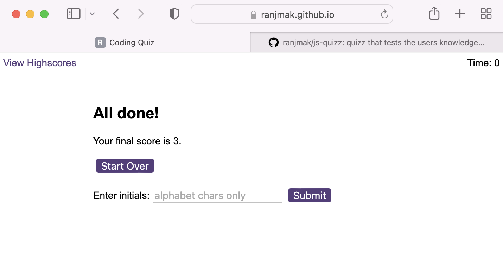
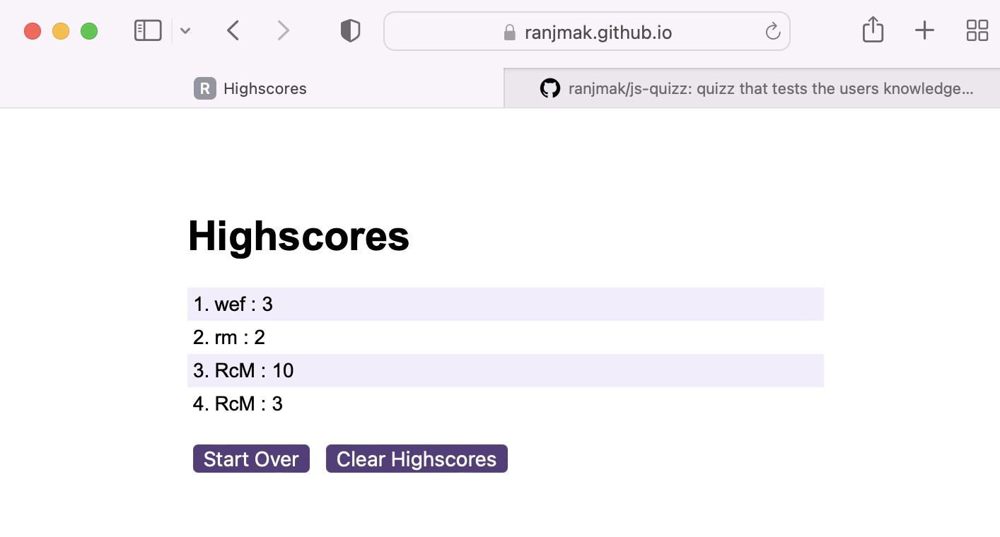

# js-quizz
quizz that tests the users knowledge of Javascript with a timed quizz. the scores are persistant across uses via local storage


# Module 6 Challenge Web APIs: Code Quiz

## the Task

Build a timed coding quiz with multiple-choice questions. This app will run in the browser, and will feature dynamically updated HTML and CSS powered by JavaScript code that you write. It will have a clean, polished, and responsive user interface. This week’s coursework has taught you all the skills you need to succeed in this challenge.


## User Story

```
AS A coding boot camp student
I WANT to take a timed quiz on JavaScript fundamentals that stores high scores
SO THAT I can gauge my progress compared to my peers
```

## Acceptance Criteria

Create a code quiz that contains the following requirements:

* A start button that when clicked a timer starts and the first question appears.
 
  * Questions contain buttons for each answer.
  * 
  * When answer is clicked, the next question appears
  * 
  * If the answer clicked was incorrect then subtract time (10 secs) from the clock

* The quiz should end when all questions are answered or the timer reaches 0.

  * When the game ends, it should display their score and give the user the ability to save their initials and their score
  
## website: https://ranjmak.github.io/js-quizz/

## Github repo: https://github.com/ranjmak/js-quizz

## screenshots





## Notes
  *  the quizz timer count is set to 75 secs and the questions stop when either the timer gets down to 0 or all questions are answered.
  *  questions are from the question.js file - currently there are 20 questions in the file, but 10 are commented out... the questions are in an array and each question is a data structure with the following:
      *  the question
      *  an array of answers
      *  the correct answer
  *  a short delay is introduced so the user can view whether they got the question right/wrong before either the next question or the scores element is shown
  *  at the end of the quizz, the user is given the option to set initials (to store in local storage) or start over
  *  the view highscores page shows a list of all persistant high scores, with the option to clear them or start over


## Grading Requirements
This challenge is graded based on the following criteria: 

### Technical Acceptance Criteria: 40%
* Satisfies all of the above acceptance criteria.

### Deployment: 32%
* Application deployed at live URL.

* Application loads with no errors.

* Application GitHub URL submitted.

* GitHub repository that contains application code.

### Application Quality: 15%

* Application user experience is intuitive and easy to navigate.

* Application user interface style is clean and polished.

* Application resembles the mock-up functionality provided in the challenge instructions.

### Repository Quality: 13%

* Repository has a unique name.

* Repository follows best practices for file structure and naming conventions.

* Repository follows best practices for class/id naming conventions, indentation, quality comments, etc.

* Repository contains multiple descriptive commit messages.

* Repository contains quality README file with description, screenshot, and link to deployed application.


## Review

You are required to submit BOTH of the following for review:

* The URL of the functional, deployed application.

* The URL of the GitHub repository. Give the repository a unique name and include a README describing the project.

---
© 2022 edX Boot Camps LLC. Confidential and Proprietary. All Rights Reserved.
